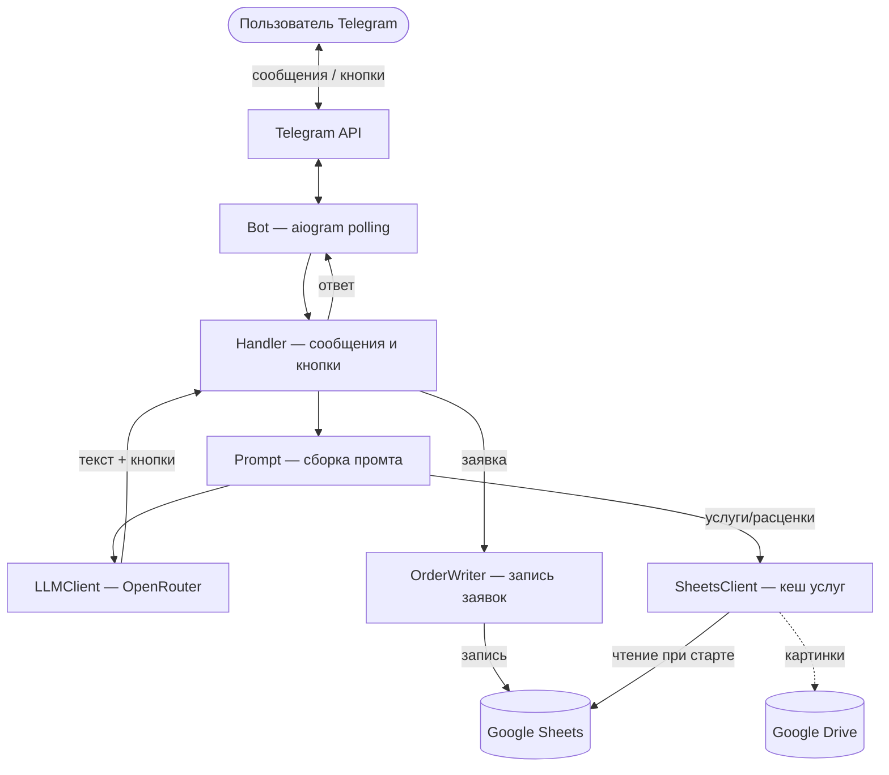
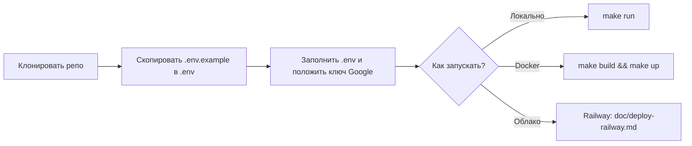

# Matveeva AI

Telegram-бот на базе LLM: знакомит потенциальных клиентов с услугами, расценками и примерами работ, помогает оформить заявку. Диалог строится через кнопки и свободный ввод. Данные об услугах и примерах подгружаются из Google Sheets и Google Drive.

**Автор:** Тимофей Матвеев  
**Статус:** MVP готов, бот работает локально, в Docker и на Railway.

---

## Что умеет бот

- Отвечает на вопросы через LLM (OpenRouter), помнит контекст диалога
- Показывает перечень услуг, цены и сроки из Google Sheets
- Отправляет картинки-примеры с Google Drive по запросу
- Собирает заявку (имя, услуга, почта, комментарий) и записывает её в Google Sheets
- Предлагает варианты ответов кнопками (формат задаётся в промте)

---

## Стек

| Назначение | Технология |
|------------|------------|
| Язык | Python 3.12 |
| Зависимости | uv |
| Telegram | aiogram 3.x (polling) |
| LLM | OpenRouter (клиент openai) |
| Google | gspread, google-auth (Service Account) |
| Контейнер | Docker |
| Сборка/запуск | Make |

---

## Архитектура



---

## Запуск



- **Локально:** `make run` (нужны `uv`, заполненный `.env`, файл ключа по пути из `GOOGLE_APPLICATION_CREDENTIALS`).
- **Docker:** `make build` → `make up`. В `.env` — путь к `service_account.json` на хосте; контейнер монтирует файл внутрь.
- **Railway:** деплой из GitHub, переменные в панели Railway, ключ Google — в переменной `GOOGLE_SERVICE_ACCOUNT_JSON`. Подробно: [doc/deploy-railway.md](doc/deploy-railway.md).

---

## Структура проекта

```
├── bot/           # код бота (main, config, handler, llm_client, sheets_client, order_writer, prompt)
├── doc/            # vision.md, tasklist.md, deploy-railway.md
├── .env.example    # шаблон переменных окружения
├── Dockerfile
├── Makefile        # run, build, up, down, logs
└── pyproject.toml
```

Полный список переменных — в `.env.example`. Ключ Google: локально/Docker — путь в `GOOGLE_APPLICATION_CREDENTIALS`; на Railway — содержимое JSON в `GOOGLE_SERVICE_ACCOUNT_JSON`.

---

## Документация

| Файл | Содержание |
|------|------------|
| [doc/vision.md](doc/vision.md) | Техническое видение, архитектура, сценарии, конфигурация |
| [doc/tasklist.md](doc/tasklist.md) | План итераций и прогресс разработки |
| [doc/deploy-railway.md](doc/deploy-railway.md) | Пошаговый деплой на Railway |
