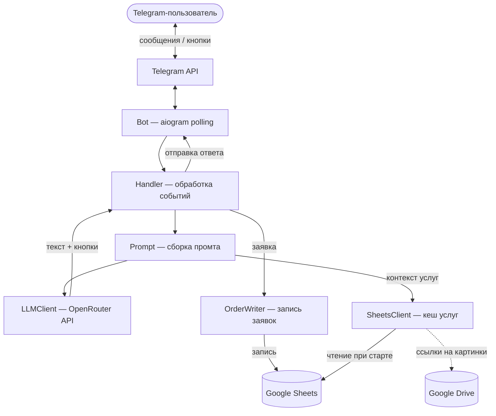
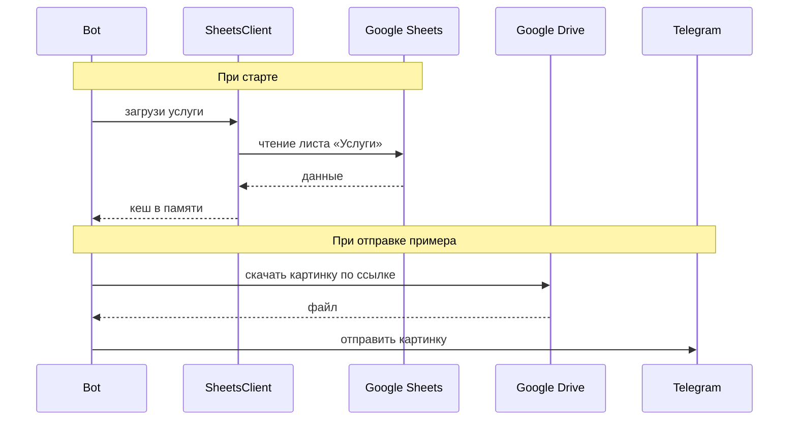
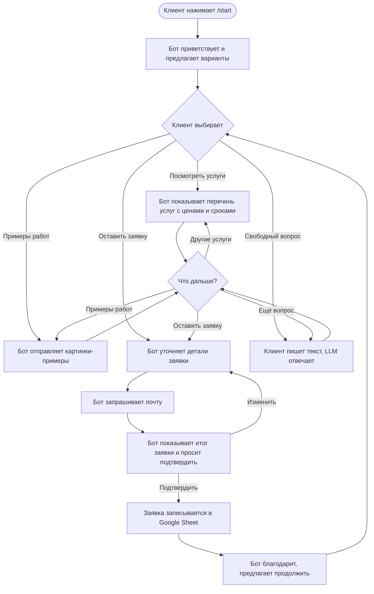

# Техническое видение: LLM-ассистент (Telegram-бот)

## 1. Технологии

| Назначение | Технология |
|---|---|
| Язык | Python 3.12 |
| Управление зависимостями | uv |
| Telegram Bot API | aiogram 3.x (polling) |
| Работа с LLM | openai (Python-клиент) через OpenRouter |
| Google Sheets / Drive | gspread + google-auth (Service Account) |
| Контейнеризация | Docker |
| Автоматизация сборки/запуска | Make |
| Логгирование | стандартный logging (Python) |
| Конфигурация | переменные окружения + .env файл |

## 2. Принципы разработки

- **KISS** — минимально необходимая реализация, без усложнений.
- **ООП** — строго 1 класс = 1 файл.
- **MVP-подход** — сначала работающий прототип, потом улучшения.
- **Конфигурация через окружение** — все секреты и настройки в `.env`, код не содержит захардкоженных значений.
- **Без базы данных** — состояние диалога живёт в памяти процесса. При перезапуске бота диалоги начинаются заново.
- **Данные из Google Sheets** — перечень услуг, расценки и ссылки на примеры читаются из Google Sheets при старте и кешируются в памяти.
- **Заявки** — сформированные заявки записываются в отдельный Google Sheet.
- **Уведомления о заявках** — при сохранении заявки опционально отправляются уведомление в Telegram (в заданный чат) и письмо на email (см. конфигурацию). Ошибки отправки только логируются, пользователю не показываются.
- **Системный промт** — хранится в переменной окружения в `.env`.

## 3. Структура проекта

```
Matveeva_AI/
├── bot/
│   ├── __init__.py
│   ├── main.py              # точка входа, запуск polling
│   ├── config.py             # класс Config — чтение .env
│   ├── bot.py                # класс Bot — инициализация aiogram
│   ├── handler.py            # класс Handler — обработка сообщений и callback
│   ├── llm_client.py         # класс LLMClient — общение с LLM через OpenRouter
│   ├── sheets_client.py      # класс SheetsClient — чтение услуг/расценок из Google Sheets
│   ├── order_writer.py       # класс OrderWriter — запись заявок в Google Sheet
│   ├── email_notifier.py     # класс EmailNotifier — отправка уведомления по почте при заявке
│   └── prompt.py             # класс Prompt — формирование промтов для LLM
├── doc/
│   ├── idea.md
│   └── vision.md
├── .env.example
├── Dockerfile
├── Makefile
├── pyproject.toml
└── README.md
```

## 4. Архитектура проекта



**Ключевые решения:**

- **Config** — читает `.env` один раз при старте. Остальные классы получают значения из него.
- **SheetsClient** — при старте загружает данные из Google Sheets в память. Остальные классы работают с кешем.
- **Handler** — единственная точка входа для всех событий Telegram. Хранит историю диалога каждого пользователя в `dict` (chat_id → список сообщений).
- **LLMClient** — stateless, принимает промт, возвращает ответ.
- **Кнопки** — LLM генерирует варианты кнопок в ответе по заданному формату в промте. Handler парсит ответ и формирует inline-кнопки Telegram.

## 5. Модель данных

На MVP нет базы данных. Все данные — в памяти процесса или в Google Sheets.

### Google Sheet «Услуги» (чтение при старте)

| Колонка | Описание |
|---|---|
| Название | Название услуги |
| Описание | Краткое описание |
| Цена | Стоимость |
| Сроки | Сроки выполнения |
| Пример (ссылка) | Ссылка на картинку-пример на Google Drive |

### Google Sheet «Заявки» (запись ботом)

| Колонка | Описание |
|---|---|
| Дата | Дата создания заявки |
| Имя клиента | Telegram-имя пользователя |
| Почта | E-mail клиента |
| Услуга | Выбранная из списка или описание в свободной форме |
| Комментарий | Пожелания клиента из диалога |

### В памяти (dict)

- `chat_id → список сообщений` — история диалога для контекста LLM.

## 6. Работа с LLM

**Провайдер:** OpenRouter (API-совместим с OpenAI).

**Клиент:** библиотека `openai`, у которой переопределяется `base_url` на OpenRouter.

**Модель:** название модели задаётся в `.env` (`LLM_MODEL`), что позволяет быстро переключаться между моделями без изменения кода.

**Формат общения:**

- Каждый запрос — массив сообщений: `[system, user, assistant, user, ...]`
- **system** — системный промт из `.env` + актуальный перечень услуг/расценок из кеша.
- **user / assistant** — история диалога конкретного пользователя.

**Формат ответа LLM:**

LLM возвращает текстовый ответ + варианты кнопок в специальном формате:

```
Вот наши услуги! Что вас интересует?

[buttons]
Дизайн логотипа
Оформление соцсетей
Полиграфия
Свободный вопрос
[/buttons]
```

Handler парсит блок `[buttons]...[/buttons]` и формирует inline-кнопки Telegram. Остальной текст отправляется как сообщение.

**Ограничение контекста:** хранить не более N последних сообщений на пользователя (`MAX_HISTORY_MESSAGES` в `.env`), чтобы не превышать лимит токенов.

## 7. Работа с Google Drive

**Авторизация:** Service Account. Ключ сервисного аккаунта хранится в файле `service_account.json` в корне проекта (не коммитится в git). Google Sheets и папка на Google Drive расшариваются на email сервисного аккаунта. Никакого интерактивного OAuth-флоу не требуется.

**Google Sheets (gspread):**

- При старте бота `SheetsClient` авторизуется и читает лист «Услуги» целиком в память.
- Обновление кеша — только при перезапуске бота.
- `OrderWriter` при оформлении заявки дописывает строку в лист «Заявки».

**Google Drive (картинки):**

- В таблице услуг лежат ссылки на картинки-примеры на Google Drive.
- Когда LLM упоминает услугу с примером, Handler берёт ссылку из кеша и отправляет картинку пользователю в Telegram.
- Картинки скачиваются с Google Drive по прямой ссылке.



## 8. Сценарии работы



**Важно:** весь диалог управляется LLM. Схема выше — ожидаемое поведение, которое задаётся через системный промт. Жёсткой «машины состояний» в коде нет — LLM сама ведёт диалог в нужном направлении.

Команда `/start` — единственная жёстко обрабатываемая команда (сбрасывает историю диалога и начинает заново).

## 9. Подход к конфигурированию

Вся конфигурация — через переменные окружения в файле `.env`. Класс `Config` читает его при старте.

### Переменные `.env`

| Переменная | Описание |
|---|---|
| `TELEGRAM_BOT_TOKEN` | Токен Telegram-бота |
| `OPENROUTER_API_KEY` | API-ключ OpenRouter |
| `LLM_MODEL` | Название модели (например, `google/gemini-2.0-flash-001`) |
| `SYSTEM_PROMPT` | Системный промт с информацией о мастере |
| `MAX_HISTORY_MESSAGES` | Максимум сообщений в истории диалога |
| `GOOGLE_SHEETS_SERVICES_URL` | URL таблицы «Услуги» |
| `GOOGLE_SHEETS_ORDERS_URL` | URL таблицы «Заявки» |
| `TELEGRAM_NOTIFY_CHAT_ID` | (опционально) ID чата для уведомлений о новых заявках |
| `SMTP_HOST`, `SMTP_PORT`, `SMTP_USER`, `SMTP_PASSWORD` | (опционально) настройки SMTP для отправки писем |
| `NOTIFY_EMAIL` | (опционально) адрес, на который приходит письмо о новой заявке |

Файл `.env.example` с пустыми значениями коммитится в git. Файл `.env` с реальными значениями — нет.

### Файл секретов Google

| Файл | Описание |
|---|---|
| `service_account.json` | Ключ сервисного аккаунта Google (скачивается из Google Cloud Console) |

Путь захардкожен в `Config` — файл всегда лежит в корне проекта.

### .gitignore

Не коммитятся: `.env`, `service_account.json`.

## 10. Подход к логгированию

Стандартный модуль `logging` из Python. Без сторонних библиотек.

- **Формат лога:** `время — уровень — имя класса — сообщение`
- **Уровень по умолчанию:** `INFO` (настраивается через `LOG_LEVEL` в `.env`)
- **Вывод:** stdout. В Docker логи доступны через `docker logs`.
- **Что логируем:**
  - Старт / остановка бота
  - Загрузка данных из Google Sheets
  - Входящие сообщения (chat_id, текст кнопки или начало сообщения)
  - Запросы к LLM (chat_id, факт запроса, без полного промта)
  - Запись заявки
  - Отправка уведомлений о заявке (Telegram / email) или ошибки отправки
  - Ошибки

## 11. Подход к сборке и деплою

### Makefile

| Команда | Описание |
|---|---|
| `make run` | Запуск бота локально без Docker (`uv run`) |
| `make build` | Сборка Docker-образа |
| `make up` | Запуск в Docker-контейнере |
| `make down` | Остановка контейнера |
| `make logs` | Просмотр логов контейнера |

### Docker

- Один `Dockerfile`, один контейнер.
- Базовый образ: `python:3.12-slim`.
- Зависимости ставятся через `uv` внутри контейнера.
- `.env` и `service_account.json` прокидываются через volume или `--env-file`.

### Деплой на удалённый сервер

На MVP — ручной деплой:

1. Склонировать репозиторий на сервер.
2. Положить `.env`, `service_account.json`.
3. `make up` — бот запущен.
